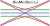

<div align="center">
  <picture>
    <source media="(prefers-color-scheme: dark)" srcset="./docs/src/assets/logo-dark.svg">
    <source media="(prefers-color-scheme: light)" srcset="./docs/src/assets/logo.svg">
    
  </picture>
</div>

# About

**BeamletOptics.jl**, or **BMO** for short, is a 3D Gaussian beamlet tracing software mainly intended for the simulation of breadboard optical setups -- e.g. laser interferometers -- with simple components like lenses or beamsplitters. It offers a flexible kinematic API for the easy placement and movement of components.

[For more information, refer to the documentation.](https://optical-air-data.pages.gitlab.dlr.de/dispersionsinterferometer/beamletoptics/)

# Features

- Hybrid sequential and non-sequential 3D ray tracing without paraxial approximation
- TEM₀₀ Gaussian beamlet models
- Various optical components
    - Mirrors
    - Lenses
    - Beamsplitters
    - Detectors
- Surface-like modeling of rotationally symmetrical lens systems
- Extendable API design for the implementation of custom optical interactions
- Easy visualization via the [Makie](https://github.com/MakieOrg/Makie.jl) package

# Installation

To install this package in your current project environment, enter the Pkg REPL-mode via `]` and `add BeamletOptics` or in the REPL enter:

```julia
using Pkg; Pkg.add("BeamletOptics")
```

# Examples

For a variety of illustrated examples and tutorials, refer to the **Tutorials** and **Examples** sections of the documentation linked to above.