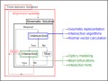

# Core design

The BMO package is intended to provide optical simulation capabilites with as much "out-of-the-box" comfort as possible, meaning that users should not have to worry about e.g. providing the correct optical sequence and exact alignment of objects. The following five design principles are core assumptions of the underlying API:

1. Optical interactions are decoupled from the underlying geometry representation
2. Optical elements are closed volumes or must mimic as such
3. Elements should be easily moveable and have working interactions for all angles of incidence
3. Without additional knowledge, tracing is performed non-sequentially
4. With additional knowledge, tracing is performed sequentially

## Intersect-Interact-Repeat-Loop

The first three principles will be elaborated upon in more detail in the [Geometry representation](@ref) section. For the latter two design decisions, the following high-level solver schematic is used to explain the steps that are performed when calling [`solve_system!`](@ref) with an input system and beam:

```@raw html

```

This scheme is loosely referred to as the **Intersect-Interact-Repeat-Loop** and consists of the following steps:

1. Calculate the closest **Intersection** between a ray/beam and the objects within the system
2. Calculate the optical **Interaction** that occurs at the surface or within the volume of the element
3. Attach or overwrite the next part of the ray chain
4. Use the new information to repeat 1.

Once this procedure has been completed, the alignment of the system or other time-dependent optical properties (e.g. the phase of a Gaussian beamlet) can be updated. When rerunning the solver, the algorithm will try to reuse information about the previously intersected objects to speed up the calculation of the next simulation step. This is described in more detail in the sections: [Tracing systems](@ref) and [Retracing systems](@ref).

The next sections will focus on the **Intersection** and **Interaction** steps.

## Intersections

Calculating intersections between straight lines, i.e. rays from geometrical optics, is a central element of every geometrical optics simulator. In order to define this mathematically or algorithmically, many different methods exist. The first question is, how is the geometry of the problem defined. This topic is treated in the [Geometry representation](@ref) section. The second question concerns then the algorithm or equation that allows to calculate the point of intersection between a ray and the surface of the element. This function is called `intersect3d` and is, at its core, defined for each `shape` and `ray`:

```@docs; canonical=false
BMO.intersect3d(::BMO.AbstractShape, ::BMO.AbstractRay)
```

Regardless of the underlying implementation, each call of `intersect3d` must return the following type:

```@docs; canonical=false
BMO.Intersection
```

Since an optical element can consist of multiple joint shapes, the return type must specifiy which specific part of the object was hit.

## Interactions

Optical interactions are performed after the point of intersection has been determined. The `interact3d` interface allows users to implement algorithms that calculate or try to mimic optical effects. The fidelity of the algorithm is effectively only limited by the amount of information that can be passed into the `interact3d` interface. The method is defined as follows:

```@docs; canonical=false
BMO.interact3d(::AbstractSystem, ::AbstractObject, ::AbstractBeam, ::AbstractRay)
```

As with the `intersect3d` method, a predefined return type must be provided in order to make the [`solve_system!`](@ref) interface work. The `AbstractInteraction` is used in order to create "building blocks" from which the output beam is constructed.

```@docs; canonical=false
BMO.AbstractInteraction
```


## Hints


## CPU and GPU support

!!! info
    GPU processing (tracing) of optical systems is  not supported at the moment.


