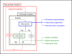
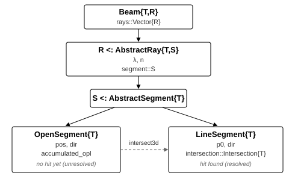
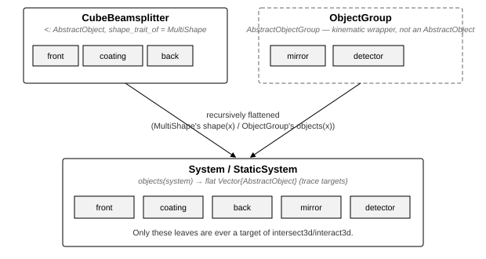

# Core design

The BMO package is intended to provide optical simulation capabilites with as much "out-of-the-box" comfort as possible, meaning that users should not have to worry about e.g. providing the correct optical sequence and exact alignment of objects. The following five design principles are core assumptions of the underlying API:

1. Optical interaction is decoupled from geometry representation.
2. Optical elements are closed volumes (or must mimic being one) — exceptions apply, e.g. coatings.
3. Elements must be freely movable and work correctly for (almost) any angle of incidence — no paraxial shortcuts, no assumed canonical orientation.
4. Without extra knowledge, tracing is non-sequential: the solver discovers what a ray/beam hits next by searching the scene, not by a user-declared optical path or object order.
5. With extra knowledge (a [`BeamletOptics.Hint`](@ref)), tracing can go sequential for performance/ambiguity resolution — but this is an optimization, never a requirement placed on the user.

## Intersect-Interact-Repeat-Loop

The first two principles will be elaborated upon in more detail in the [Geometry representation](@ref) section. For the latter two design decisions, the following high-level solver schematic can be used to abstract the steps that are performed when calling [`solve_system!`](@ref) with an input system and beam:



This scheme is loosely referred to as the **Intersect-Interact-Repeat-Loop** and consists of the following steps:

1. Calculate the closest **Intersection** between a ray/beam and the objects within the system
2. Calculate the optical **Interaction** that occurs at the surface or within the volume of the element
3. Attach or overwrite the next part of the ray chain or beam tree
4. Use the new information to repeat 1.

Once this procedure has been completed, the alignment of the system or other time-dependent optical properties (e.g. the phase of a Gaussian beamlet) can be updated. When rerunning the solver, the beam is reset to its starting ray(s) and traced again from scratch, described in more detail in the [Tracing systems](@ref) section.

The next sections will focus on the **Intersection** and **Interaction** steps.

## Ray and segment representation

Each cycle of the loop appends a new piece to the light path. This data is split across two cooperating types: an [`BeamletOptics.AbstractRay`](@ref) (the physical state — wavelength, refractive index, polarization, ...) wraps an [`BeamletOptics.AbstractSegment`](@ref) (the purely geometrical state — origin, direction and, once a hit has been found, the resulting [`BeamletOptics.Intersection`](@ref)). A [`Beam`](@ref) stores its light path as `segments::Vector{<:AbstractRay}`; the last element is either an unresolved ray (its segment is an `OpenSegment`, no hit yet) or, after tracing, a resolved ray (its segment is a `LineSegment` carrying the `Intersection`).



Splitting the ray this way keeps the [Intersections](@ref) step (which only ever needs position/direction) decoupled from the physical properties that only the [Interactions](@ref) step needs to consult (design principle 1).

## Intersections

Calculating intersections between straight lines, i.e. rays, and surfaces is a central challenge for every geometrical optics simulator. This must be done with high numerical precision, since many optical effects are sensitive on the order of the wavelength of the light under consideration with respect to position and direction [Hecht:2018; p. 265 ff](@cite). In order to define this mathematically or algorithmically, many different methods exist [Hanrahan:1989](@cite). The first question is, how is the geometry of the problem defined. This topic is treated in the [Geometry representation](@ref) section. The second question concerns then the algorithm or equation that allows to calculate the point of intersection between a ray and the surface of the element. This function is called `intersect3d` and is, at its core, defined for each `shape` and `ray`:

```@docs; canonical=false
BeamletOptics.intersect3d(::BeamletOptics.AbstractShape, ::BeamletOptics.AbstractRay)
```

Regardless of the underlying concrete implementation, each call of `intersect3d` must return `nothing` or an `AbstractIntersection`:

```@docs; canonical=false
BeamletOptics.AbstractIntersection
BeamletOptics.Intersection
BeamletOptics.MultiIntersection
```

A shape-level `intersect3d` call returns an `Intersection{T}(t, p, n)` containing hit distance, 3D point, and surface normal. When coincident boundaries occur between touching optics, a `MultiIntersection{T}` records both exiting and entering components.

## Interactions

Optical interactions are performed after the point of intersection has been determined. The `interact3d` interface allows users to implement algorithms that calculate or try to mimic optical effects. The fidelity of the algorithm is effectively only limited by the amount of information that can be passed into the `interact3d` interface. The method is defined as follows:

```@docs; canonical=false
BeamletOptics.interact3d(::BeamletOptics.AbstractSystem, ::BeamletOptics.AbstractObject, ::BeamletOptics.AbstractBeam, ::BeamletOptics.AbstractRay)
```

As with the `intersect3d` method, a predefined return type must be provided in order to make the [`solve_system!`](@ref) interface work. The `AbstractInteraction` is used in order to create "building blocks" from which the output beam is constructed.

```@docs; canonical=false
BeamletOptics.AbstractInteraction
```

The `interact3d` return type limits the interface to only accepting one new `beam` segment per interaction at the moment. The developer needs to take into account that after e.g. a lens surface air-to-glass interaction, the solver "forgets" that the next logical step is to immediatly test against the lens again, since the most likely step will be the refraction at the glass-to-air surface. In order to alleviate this issue, the `Hint` type can be used.

## Hints

As mentioned in the previous section, the [`BeamletOptics.Hint`](@ref) interface allows developers to manipulate the non-sequential solver algorithm into testing against a specific component and shape during the next cycle of the [Intersect-Interact-Repeat-Loop](@ref). This interface has very high priority during intersection testing.

```@docs; canonical=false
BeamletOptics.Hint
```

The main reason for this is the intersection ambiguity encountered at interfaces between air-tight component interfaces, e.g. [Plate beamsplitters](@ref) or cemented [Doublet lenses](@ref). This is caused by the fact that for a ray with a starting point at this interface, technically both shapes are being "touched" at the same time. Additional program logic considering the ray direction of propagation can not always resolve this ambiguity. Therefore the task of providing additional information to the solver via the `Hint` interface is placed as a **burden on the developer**.

!!! tip
    Use of the `Hint` interface is primarily intended for multishape objects with joint surfaces.

## Composite optics vs. kinematic groups

Design principle 2 states that an optical element should be a closed volume, or mimic being one — but many real components (a cube beamsplitter, a cemented doublet) are physically built from more than one [`BeamletOptics.AbstractShape`](@ref). BMO models this with the **shape trait** (`shape_trait_of`, see [`BeamletOptics.AbstractShapeTrait`](@ref)): a component that consists of several jointly-owned shapes implements [`BeamletOptics.MultiShape`](@ref) and is still a single [`BeamletOptics.AbstractObject`](@ref) with its own `interact3d` — e.g. [`CubeBeamsplitter`](@ref), [`DoubletLens`](@ref).

This is a distinct concept from [`BeamletOptics.AbstractObjectGroup`](@ref) (e.g. [`ObjectGroup`](@ref)), which is deliberately **not** an `AbstractObject`: a group has no optical identity of its own and exists purely as a kinematic convenience for moving otherwise-unrelated components together as one rigid assembly (e.g. all elements sitting on a shared mount). Consequently a group is never a target of `intersect3d`/`interact3d`.



Since the non-sequential solver (design principle 4) needs a flat list of `AbstractObject`s to test against, [`System`](@ref)/[`StaticSystem`](@ref) recursively expand both `MultiShape` composites and `AbstractObjectGroup`s down to their constituent `AbstractObject`s when tracing — this is what makes e.g. the coating of a `ThinBeamsplitter` reachable as its own intersection target, and it is also why touching composite surfaces need the `Hint` mechanism above to disambiguate.

## Tracing logic

### Tracing systems

In the initial state, is is assumed that the problem consists of `objects <: AbstractObject` (in a system) and a `beam <: AbstractBeam` with a defined starting position and direction. No additional information is provided, and the specific path of the beam is not known beforehand. Consequently, brute force tracing of the optical system is required, involving testing against each individual element to determine the trajectory of the beam.

```@docs; canonical=false
BeamletOptics.trace_system!
```

This non-sequential mode is comparatively safe in determining the "true" beam path, but will scale suboptimally in time-complexity with the amount of optical elements. After solving the system, the beam path is known; calling [`solve_system!`](@ref) again on the same beam resets it back to its starting ray(s) and performs a fresh non-sequential trace, e.g. after moving an object or changing a beam property such as its phase.

!!! info "Object order"
    Unlike with classic, surface-based ray tracers, the order in which objects are listed in the [`System`](@ref) object vector/tuple is not considered for the purpose of tracing.

## CPU and GPU support

Parallizing the execution of a [`solve_system!`](@ref) call on the CPU is straight-forward for systems that do not feature objects which can be mutated during runtime, e.g. detectors like the [`Detector`](@ref). For each beam or ray the solution is independent and the solver can run on multiple threads. Special consideration needs to be taken when implementing mutable elements as mentioned above, since multiple threads might be able to access the underlying memory, leading to race conditions. Specifically, this means ensuring e.g. atomic write and read access.

With respect to GPU acceleration, this is not the case. Currently, all available implementations of [`solve_system!`](@ref) are highly branching algorithms which can not be implemented in a parallized way easily. This will most likley require a specific new subtype of the [`BeamletOptics.AbstractSystem`](@ref) with determinable sequential properties. This is not a development goal as of the writing of this section. 


