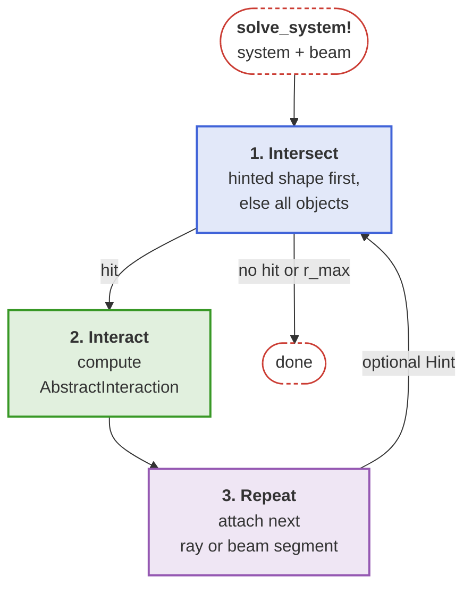

# Core design

The BMO package is intended to provide optical simulation capabilites with as much "out-of-the-box" comfort as possible, meaning that users should not have to worry about e.g. providing the correct optical sequence and exact alignment of objects. The following five design principles are core assumptions of the underlying API:

1. Optical interactions are decoupled from the underlying geometry representation
2. Optical elements are closed volumes or must mimic as such (exceptions apply, e.g. coatings)
3. Elements should be easily moveable and have working interactions for most angles of incidence
4. Without additional knowledge, tracing is performed non-sequentially
5. With additional knowledge, tracing is performed sequentially

## Intersect-Interact-Repeat-Loop

The first two principles will be elaborated upon in more detail in the [Geometry representation](@ref) section. For the latter two design decisions, the following high-level solver schematic can be used to abstract the steps that are performed when calling [`solve_system!`](@ref) with an input system and beam:


```mermaid
flowchart TB
    S(["<b>solve_system!</b><br/>system + beam"]) --> I
    I["<b>1. Intersect</b><br/>hinted shape first,<br/>else all objects"] -- hit --> X["<b>2. Interact</b><br/>compute<br/>AbstractInteraction"]
    X --> R["<b>3. Repeat</b><br/>attach next<br/>ray or beam segment"]
    R -- "optional Hint" --> I
    I -- "no hit or r_max" --> E([done])

    classDef blue fill:#4063D826,stroke:#4063D8,stroke-width:2px
    classDef green fill:#38982626,stroke:#389826,stroke-width:2px
    classDef purple fill:#9558B226,stroke:#9558B2,stroke-width:2px
    classDef terminal fill:transparent,stroke:#CB3C33,stroke-width:1.5px,stroke-dasharray:4 3
    class I blue
    class X green
    class R purple
    class S,E terminal
```

This scheme is loosely referred to as the **Intersect-Interact-Repeat-Loop** and consists of the following steps:

1. Calculate the closest **Intersection** between a ray/beam and the objects within the system
2. Calculate the optical **Interaction** that occurs at the surface or within the volume of the element
3. Attach the next part of the ray chain or beam tree
4. Use the new information to repeat 1.

Once this procedure has been completed, the alignment of the system or other time-dependent optical properties (e.g. the phase of a Gaussian beamlet) can be updated. A new call of [`solve_system!`](@ref) solves the beam again from its start. This is described in more detail in the section: [Tracing systems](@ref).

The next sections will focus on the **Intersection** and **Interaction** steps.

## Intersections

Calculating intersections between straight lines, i.e. rays, and surfaces is a central challenge for every geometrical optics simulator. This must be done with high numerical precision, since many optical effects are sensitive on the order of the wavelength of the light under consideration with respect to position and direction [Hecht:2018; p. 265 ff](@cite). In order to define this mathematically or algorithmically, many different methods exist [Hanrahan:1989](@cite). The first question is, how is the geometry of the problem defined. This topic is treated in the [Geometry representation](@ref) section. The second question concerns then the algorithm or equation that allows to calculate the point of intersection between a ray and the surface of the element. This function is called `intersect3d` and is, at its core, defined for each `shape` and `ray`:

```@docs; canonical=false
BeamletOptics.intersect3d(::BeamletOptics.AbstractShape, ::BeamletOptics.AbstractRay)
```

Regardless of the underlying concrete implementation, each call of `intersect3d` must return `nothing` or the following type:

```@docs; canonical=false
BeamletOptics.Intersection
```

Since an optical element can consist of multiple joint shapes, the return type must store which specific part of the object was hit.

### Bounding sphere pretest

Since the tracing is non-sequential, every ray is tested against every shape of the system, and most of these tests are misses. A shape can therefore provide a sphere that encloses it. A ray that does not pass through this sphere is a miss without a call of `intersect3d`. This is optional: a shape without a sphere is tested as described above.

```@docs; canonical=false
BeamletOptics.bounding_sphere_of(::BeamletOptics.AbstractShape)
```

All [Signed Distance Functions (SDFs)](@ref) and [Meshes](@ref) have a bounding sphere. An object of several shapes and an object group have the sphere around the spheres of their parts, such that a ray that misses it is tested against none of them.

The spheres are not stored in the shapes or objects. [`solve_system!`](@ref) computes them once per call, for the poses that the objects have at that time, via `bounding_sphere_of(x)` into a table, which the intersection code reads per ray via `bounding_sphere_of(table, x)`. Outside of a solve there is no table, i.e. a direct call of `intersect3d(object, ray)` tests the object without a sphere.

```@docs; canonical=false
BeamletOptics.bounding_sphere_of(::BeamletOptics.BoundingSphereTable, ::Any)
BeamletOptics.SingleBoundingSphere
BeamletOptics.MultiBoundingSphere
BeamletOptics.NoBoundingSphere
```

The spheres of a system can be shown via [`render_bounding_sphere!`](@ref) or the `show_bounding_sphere` keyword of [`render!`](@ref).

## Interactions

Optical interactions are performed after the point of intersection has been determined. The `interact3d` interface allows users to implement algorithms that calculate or try to mimic optical effects. The fidelity of the algorithm is effectively only limited by the amount of information that can be passed into the `interact3d` interface. The method is defined as follows:

```@docs; canonical=false
BeamletOptics.interact3d(::BeamletOptics.AbstractSystem, ::BeamletOptics.AbstractObject, ::BeamletOptics.AbstractBeam, ::BeamletOptics.AbstractRay)
```

As with the `intersect3d` method, a predefined return type must be provided in order to make the [`solve_system!`](@ref) interface work. The `AbstractInteraction` is used in order to create "building blocks" from which the output beam is constructed.

```@docs; canonical=false
BeamletOptics.AbstractInteraction
```

An object whose `interact3d` method stores data in the object, e.g. a detector its hits, also implements [`initialize!`](@ref), which discards this data before a new solve.

The `interact3d` return type limits the interface to only accepting one new `beam` segment per interaction at the moment. The developer needs to take into account that after e.g. a lens surface air-to-glass interaction, the solver "forgets" that the next logical step is to immediately test against the lens again, since the most likely step will be the refraction at the glass-to-air surface. In order to alleviate this issue, the `Hint` type can be used.

### Re-emitting components

Some components do not continue a beam where it ended, but hand it to another solver and emit the result elsewhere, e.g. a fiber that takes the light at its input facet and releases it at its output facet. Their `interact3d` method samples the incoming beamlet segment as a field, lets the other solver compute the field at the exit and starts new beamlets there. The exchange format is the `PlaneField` of [OpticsBase.jl](https://github.com/StackEnjoyer/OpticsBase.jl) (see [OpticsBase interoperability](@ref)):

```julia
function BeamletOptics.interact3d(::AbstractSystem, fiber::MyFiber, agb::AstigmaticGaussianBeamlet, id::Int)
    f = PlaneField(agb, id; size, spacing, origin, axes)      # the segment that hit the fiber, on its input plane
    g = other_solver(f)                                       # PlaneField at the exit, with the full phase
    BeamletOptics.relaunch!(agb, [GaussianModeDecomposition(g)])
    return nothing
end
```

The new beamlets are attached with [`BeamletOptics.relaunch!`](@ref) instead of `children!`. Children added by `children!` continue the parent: its length, optical path and reference plane are counted on. A re-emitted beamlet already carries the full phase in its amplitude and starts at another place, so it must count its optical path from its own start.

```@docs; canonical=false
BeamletOptics.relaunch!
```

```@docs
OpticsBase.PlaneField(::Union{GaussianBeamlet, AstigmaticGaussianBeamlet}, ::Integer)
```

## Hints

As mentioned in the previous section, the [`BeamletOptics.Hint`](@ref) interface allows developers to manipulate the non-sequential solver algorithm into testing against a specific component and shape during the next cycle of the [Intersect-Interact-Repeat-Loop](@ref). This interface has very high priority during intersection testing.

```@docs; canonical=false
BeamletOptics.Hint
```

The main reason for this is the intersection ambiguity encountered at interfaces between air-tight component interfaces, e.g. [Plate beamsplitters](@ref) or cemented [Doublet lenses](@ref). This is caused by the fact that for a ray with a starting point at this interface, technically both shapes are being "touched" at the same time. Additional program logic considering the ray direction of propagation can not always resolve this ambiguity. Therefore the task of providing additional information to the solver via the `Hint` interface is placed as a **burden on the developer**.

!!! tip
    Use of the `Hint` interface is primarily intended for multishape objects with joint surfaces.

## Tracing logic

### Tracing systems

In the initial state, is is assumed that the problem consists of `objects <: AbstractObject` (in a system) and a `beam <: AbstractBeam` with a defined starting position and direction. No additional information is provided, and the specific path of the beam is not known beforehand. Consequently, brute force tracing of the optical system is required, involving testing against each individual element to determine the trajectory of the beam.

```@docs; canonical=false
BeamletOptics.trace_system!
```

This non-sequential mode is comparatively safe in determining the "true" beam path, but will scale suboptimally in time-complexity with the amount of optical elements.

!!! info "Object order"
    Unlike with classic, surface-based ray tracers, the order in which objects are listed in the [`System`](@ref) object vector/tuple is not considered for the purpose of tracing.

## CPU and GPU support

Parallizing the execution of a [`solve_system!`](@ref) call on the CPU is straight-forward for systems that do not feature objects which can be mutated during runtime, e.g. detectors like the [`Detector`](@ref). For each beam or ray the solution is independent and the solver can run on multiple threads. Special consideration needs to be taken when implementing mutable elements as mentioned above, since multiple threads might be able to access the underlying memory, leading to race conditions. Specifically, this means ensuring e.g. atomic write and read access.

With respect to GPU acceleration, this is not the case. Currently, all available implementations of [`solve_system!`](@ref) are highly branching algorithms which can not be implemented in a parallized way easily. This will most likley require a specific new subtype of the [`BeamletOptics.AbstractSystem`](@ref) with determinable sequential properties. This is not a development goal as of the writing of this section. 


