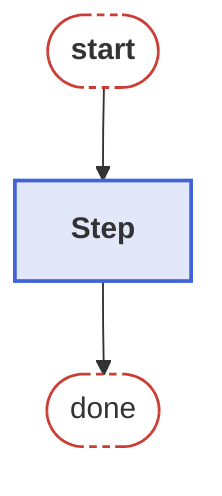
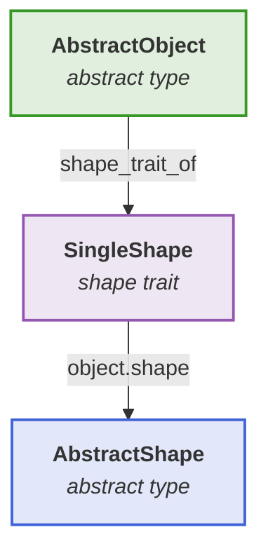

# Documentation development

If you want to edit the package documentation locally, follow these steps:

1. Create your local dev. repository via `] dev BeamletOptics`
2. Switch into the `docs` environment, e.g. `] activate .` inside of the `docs` folder
    1. Inside of [VS Code](https://code.visualstudio.com/) you can activate the local environment by right-clicking the `make.jl` file
    2. If you have the Julia plugin installed, you will be able to select `Julia: Activate This Environment`
3. Inside of the `docs` environment run `] instantiate` 
    1. `docs` is part of the package's workspace and declares `[sources] BeamletOptics = {path = ".."}`, so the local checkout is used automatically
4. Run the `make.jl` file

The generated site is written to `docs/build/1`. DocumenterVitepress builds one site per
deployment base, and a local build always ends up in the first (and only) one.

To preview it, serve `docs/build/1` as the server root -- VitePress uses absolute paths, so
opening `index.html` from the file system does **not** work.

With the
[Live Server](https://marketplace.visualstudio.com/items?itemName=ritwickdey.LiveServer)
extension for VS Code, point the server root at the build folder. The `.vscode` folder is
not tracked by git, so create `.vscode/settings.json` in your local clone yourself:

```json
{
    "liveServer.settings.root": "/docs/build/1",
    "liveServer.settings.port": 5501
}
```

The path is relative to the workspace root, which has to be the repository root for this to
work. The port is optional and only needed if the default (5500) is already taken. With that
in place, *Go Live* serves the docs. Alternatively, from the `docs` environment:

```julia
using LiveServer
LiveServer.serve(dir = "build/1")
```

!!! note
    On Windows, `make.jl` runs the VitePress build itself, because DocumenterVitepress
    skips that step there. Node comes from `NodeJS_20_jll`, so no system-wide Node.js
    installation is required. The first build downloads the npm packages into
    `docs/node_modules` and therefore takes noticeably longer.

## Section titles

When creating a custom section in the documentation, you should avoid naming the section the same way as your type, e.g. for `MyCustomType` you should not create a section that is called `# MyCustomType`. The reason for this is that the `@ref` macro will confuse the docstring of your type with the section header, leading to undefined behavior for any links pointing to the embedded docstring via `[`MyCustomType`](@ref)`.

## Tables

Documenter parses pages with Julia's Markdown parser, which does not pass inline HTML such as `<center>` through. To center a table and give it the docs' framed table style, wrap it in two `@raw html` blocks that open and close a `bmo-table` container (styled in `docs/src/.vitepress/theme/overrides.css`):

````markdown
```@raw html
<div class="bmo-table">
```

| $k$ | surface family |
| :---: | --- |
| $k = -1$ | paraboloid |
| $k = 0$ | sphere |

```@raw html
</div>
```
````

Keep the blank lines around the table, otherwise it is not parsed as Markdown. Column alignment uses the usual `:---`, `:---:` and `---:` markers.

## Diagrams

Diagrams are written as [Mermaid](https://mermaid.js.org/) code blocks with the `mermaid` language tag, which VitePress renders in the browser. Font size and box padding are set once for the whole site in the `mermaid` entry of `docs/src/.vitepress/config.mts`, so a diagram needs no `%%{init: ...}%%` line of its own. Diagrams narrower than the body text are centered by a rule in `docs/src/.vitepress/theme/overrides.css`.

Label text is set to the size of the body text, but a diagram that is wider than the page is scaled down to fit, and its text shrinks with it. Since the page is narrow but can be arbitrarily long, top-to-bottom layouts (`flowchart TB`) usually stay more readable than left-to-right ones.

To color nodes, the following class definitions can be copied into a diagram and assigned with `class <nodes> <name>`. The colors are the Julia logo colors with a translucent fill, so they work in light and dark mode:

````markdown

````

For example, the [Intersect-Interact-Repeat-Loop](@ref) uses `terminal` for its entry and exit points and one color per step.

### Type diagrams

Relations between types are drawn as flowcharts as well, since Mermaid `classDiagram`s ignore `classDef` colors, always draw both member compartments (leaving empty boxes), and use a different font size. The type diagrams on the [Geometry representation](@ref) and [Kinematic system](@ref) pages can serve as a starting point, e.g.:

````markdown

````

Inside a label, `<` has to be written as `#lt;`, e.g. `abstract type #lt;: AbstractObject`. Type diagrams tend to grow sideways: an edge that skips a row needs a column of its own, and a label on such an edge widens that column further.

!!! warning "Label line height"
    Mermaid measures the size of a label outside of the page, but VitePress renders it with the page styles, e.g. a larger line height for `p`, which clips the last line of a label. The rule `.vp-doc .mermaid p` in `docs/src/.vitepress/theme/overrides.css` keeps the rendered size equal to the measured one; do not remove it. If a new HTML tag in a label causes clipping, it needs a rule of the same kind.

## Creating figures

In general, you can generate and include figures into your documentation section any way you see fit. We strongly urge you to use the existing `CairoMakie` or `GLMakie` backend. However, with the increasing amount of plots and corresponding scripts the build time for the docs in a local environment has become unsustainable. Therefore, for the BMO docs we recommend that you adhere to the following design pattern:

1. Place your code in a standalone `.jl`-script within the `docs\src\assets` folder. 
    - refer to existing scripts for a rough guideline
    - do not forget to activate the appropriate backend via e.g. `GLMakie.activate!()`
2. Make sure that each figure in your script is saved via a `save("my_fig.png", my_fig, ...)` statement
    - files will be saved with respect to the calling environment
3. In the markdown file that contains your documentation and should load your images, do the following:
    1. create a `@setup` code block
    2. load your script during build via `Main.DocUtils.conditional_include`
        - more info on this function is provided in the `DocUtils.jl` file
    3. Or, alternatively use `Main.DocUtils.prerender_include` to generate the image locally
4. Load the image within your markdown file via ``

Examples for this pattern can be found at the top of most .md files of the documentation, e.g. `beamsplitters.md`.

!!! tip
    Usage of placeholders can be disabled for each script via the `use_placeholder=false` keyword argument. It can also be deactivated globally by setting `GLOBAL_USE_PLACEHOLDERS=false` in the `DocUtils.jl` file.
