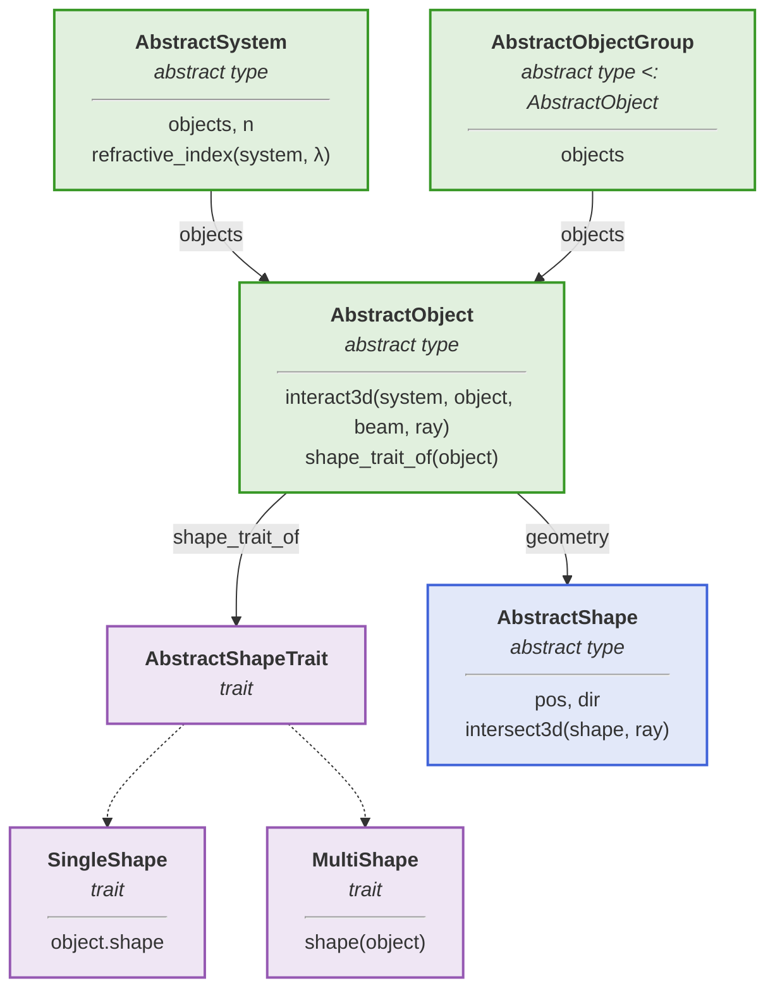
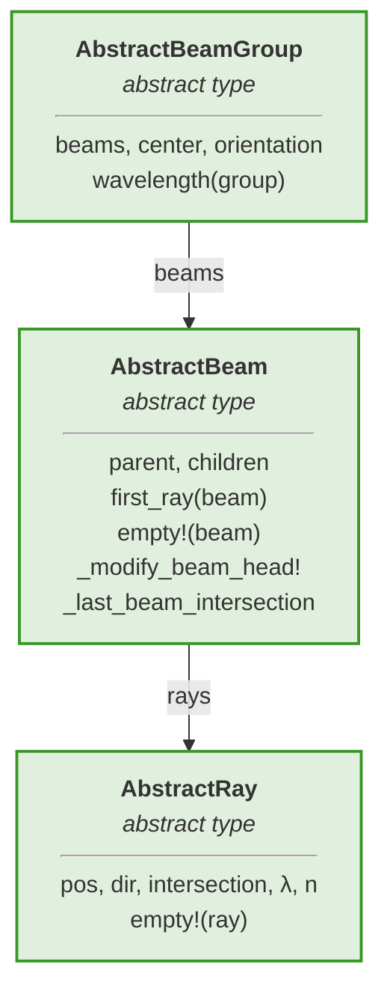

# Geometry representation

In BMO, the distinction between an *object* and its geometric representation (*shape*) is a central design principle. This separation is intended to ensure flexibility and modularity in modeling optical components. Unlike the surface based representation of optical elements in other tools, they are **treated as volumetric bodies** in this simulation framework.

## Separation of geometry and optical interactions

Each card lists the fields and functions that a subtype must provide. Solid arrows point from a field to the type it stores, dotted arrows point to subtypes.



Light sources are structured analogously, but carry no shape:



The geometry, represented by a concrete subtype of the [`BeamletOptics.AbstractShape`](@ref), defines the physical boundaries of the element. Shapes can be represented in various forms, such as [Meshes](@ref) or [Signed Distance Functions (SDFs)](@ref). The main goal for this design choice is to allow for the possibility to switch out geometry representations for more advanced methods in the future, e.g. [NURBS.jl](https://github.com/HoBeZwe/NURBS.jl).

```@docs; canonical=false
BeamletOptics.AbstractShape
```

On the other hand, the optical behavior — how light interacts with the element — is defined by the [`BeamletOptics.AbstractObject`](@ref) type. This decoupling allows for independent development and extension of geometry representations and optical interaction models within the [Intersect-Interact-Repeat-Loop](@ref).

```@docs; canonical=false
BeamletOptics.AbstractObject
```

## Single and multi-shaped objects

An `AbstractObject` can consist of multiple `AbstractShape`s or even multiple subsidiary `AbstractObject`s, facilitating the creation of composite optical elements. For example, a lens with an anti-reflective coating could be represented as the substrate and a seperate model for the coating, each with its own geometric and optical properties. In general, an `object` can have the `SingleShape` or a `MultiShape` trait. The [`BeamletOptics.AbstractShapeTrait`] allows the solver and kinematic API to apply different implementations of basis functions via multiple dispatch. 

```@docs; canonical=false
BeamletOptics.SingleShape
BeamletOptics.MultiShape
```
