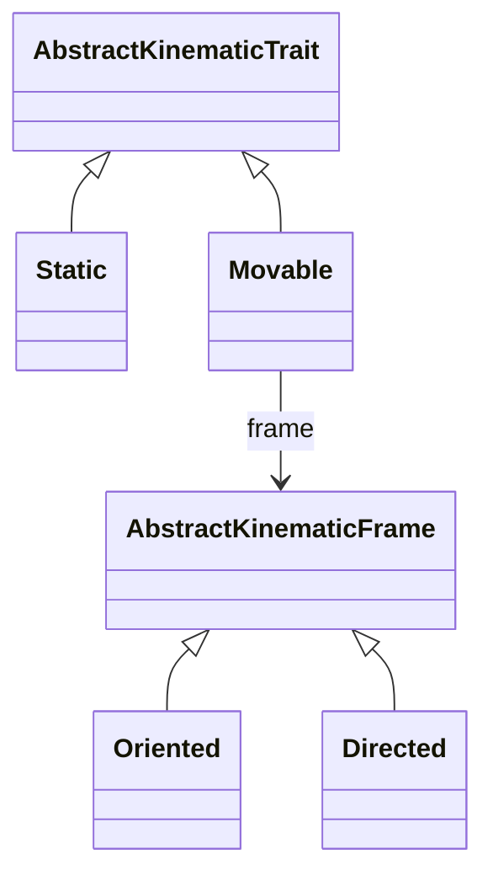

# Kinematic system

This page explains how the kinematic API described in the [Kinematics](@ref) section is implemented, and what a developer has to provide so that a new optical element, ray or beam type can be moved with it.

## Kinematic traits

Analogous to the [`BeamletOptics.AbstractShapeTrait`](@ref) of the [Geometry representation](@ref), the kinematic API is built on a trait that is dispatched on via multiple dispatch. Every public kinematic function, e.g. `translate3d!(x, offset)`, forwards to a trait-specific method `translate3d!(kinematic_trait_of(x), x, offset)`.



```@docs; canonical=false
BeamletOptics.AbstractKinematicTrait
BeamletOptics.kinematic_trait_of
```

## Static and movable entities

Whether an entity can be moved at all is defined by its trait. The fallback of [`BeamletOptics.kinematic_trait_of`](@ref) is [`BeamletOptics.Static`](@ref), so types that do not opt in cannot be moved. The abstract types [`BeamletOptics.AbstractObject`](@ref), [`BeamletOptics.AbstractRay`](@ref), [`BeamletOptics.AbstractBeam`](@ref) and [`BeamletOptics.AbstractBeamGroup`](@ref) declare themselves [`BeamletOptics.Movable`](@ref), so a new subtype of them only has to implement the kinematic primitives listed below.

```@docs; canonical=false
BeamletOptics.Static
BeamletOptics.Movable
```

## Oriented and directed frames

The frame of a [`BeamletOptics.Movable`](@ref) entity selects whether the derived functions work on a full local coordinate system or only on a direction vector. Shapes, objects and beam groups are [`BeamletOptics.Oriented`](@ref), whereas rays and beams are [`BeamletOptics.Directed`](@ref).

```@docs; canonical=false
BeamletOptics.AbstractKinematicFrame
BeamletOptics.Oriented
BeamletOptics.Directed
```

## Type-specific implementation requirements

The primitives `translate3d!(::Movable, x, offset)` and `rotate3d!(::Movable, x, R)` are implemented differently for the individual abstract types. The requirements for subtypes are listed in the `Kinematic` section of the respective docstrings:

- [`BeamletOptics.AbstractObject`](@ref): the primitives forward to the [`BeamletOptics.AbstractShapeTrait`](@ref) of the object, see [`BeamletOptics.SingleShape`](@ref) and [`BeamletOptics.MultiShape`](@ref)
- [`BeamletOptics.AbstractRay`](@ref): only subtypes carrying direction-dependent data (e.g. the field vector of a [`PolarizedRay`](@ref)) need their own `rotate3d!`
- [`BeamletOptics.AbstractBeam`](@ref): either implement `_component_beams` or the two primitives; every move resets the beam via `empty!`
- [`BeamletOptics.AbstractBeamGroup`](@ref): moves its `beams` rigidly about the group `center`
