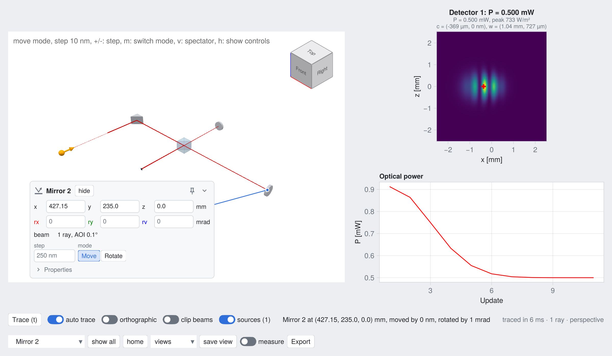

# Visualization

There are two ways to look at a simulation: the interactive GUI of the package BeamletOpticsGUI,
in which the components are moved with the mouse and the beams and detector signals follow live,
and the render functions of BeamletOptics itself, which draw systems and beams into any
[Makie](https://docs.makie.org) scene, e.g. for figures. The GUI draws with the same render
functions.

## Interactive GUI

[BeamletOpticsGUI](https://github.com/StackEnjoyer/BeamletOpticsGUI.jl) opens a setup in an interactive window: select and move components
with the mouse, keyboard or the card of a component, and the systems are solved again after each
change. Detector panels show spot diagrams or intensities with metrics, clip planes cut into the
setup, beams and distances can be measured, and the changed poses are exported as Julia code.
Own components get their own cards, and own panels, controls and tools can be added.

```julia
using GLMakie, BeamletOptics, BeamletOpticsGUI

gui = live_view(system, beam; layout = :app)
display(gui)
```



The GUI is a separate package, since it depends on Makie and changes independently of the optics.
It builds on the [live rendering](@ref "Live rendering") and the
[render handle protocol](@ref "Render handle protocol") described below. Installation, the
features and the API are documented in the [BeamletOpticsGUI repository](https://github.com/StackEnjoyer/BeamletOpticsGUI.jl).

## Rendering with Makie

The following sections describe the render functions of BeamletOptics. Refer to the extensive
`Makie` documentation and the **Examples** and the **Tutorials** sections of this package for a
variety of showcases on how to visualize your simulation.

## Rendering elements

The main function provided for visualization purposes is the [`render!`](@ref) function. 

```@docs; canonical=false
render!(::Any, ::BeamletOptics._RenderTypes)
```

If a suitable backend is loaded, additional dispatched `render!` functions will become available. For instance, this allows the plotting of a [`GaussianBeamlet`](@ref).

## Loading the extension

Refer to the following snippet for an example on how the extension loading behaves. When only BMO is loaded, the `render!` function becomes available but will throw an [`BeamletOptics.MissingBackendError`](@ref) when trying to plot something.

```julia
julia> using BeamletOptics

julia> methods(render!)
# 1 method for generic function "render!" from BeamletOptics:
 [1] render!(::Any, ::Union{BeamletOptics.AbstractSystem, BeamletOptics.AbstractBeam, BeamletOptics.AbstractObject, BeamletOptics.AbstractObjectGroup, BeamletOptics.AbstractRay, BeamletOptics.AbstractShape}, kwargs...)
     @ C:\Users\anon\.julia\dev\BeamletOptics\src\Render.jl:56

julia> axis = nothing;

julia> mirror = RoundPlanoMirror(25e-3, 5e-3);

julia> render!(axis, mirror)
ERROR: It appears no suitable Makie backend is loaded in this session.
Stacktrace:
 [1] render!(::Nothing, ::Mirror{Float64, BeamletOptics.PlanoSurfaceSDF{Float64}})
   @ BeamletOptics c:\Users\anon\.julia\dev\BeamletOptics\src\Render.jl:46
 [2] top-level scope
   @ REPL[5]:1
```

Once a backend has been loaded, additional dispatched versions of `render!` become available.

```julia
julia> using GLMakie

julia> methods(render!)
# 21 methods for generic function "render!" from BeamletOptics:
  [1] render!(ax::Union{Axis3, LScene}, s::BeamletOptics.UnionSDF; kwargs...)
     @ BeamletOpticsMakieExt C:\Users\anon\.julia\dev\BeamletOptics\ext\RenderSDF.jl:32
  [2] render!(axis::Union{Axis3, LScene}, css::BeamletOptics.ConcaveSphericalSurfaceSDF; color, kwargs...)
     @ BeamletOpticsMakieExt C:\Users\anon\.julia\dev\BeamletOptics\ext\RenderLenses.jl:1
  [3] render!(axis::Union{Axis3, LScene}, css::BeamletOptics.ConvexSphericalSurfaceSDF; color, kwargs...)
     @ BeamletOpticsMakieExt C:\Users\anon\.julia\dev\BeamletOptics\ext\RenderLenses.jl:31
  [4] render!(axis::Union{Axis3, LScene}, acyl::BeamletOptics.AbstractAcylindricalSurfaceSDF; color, kwargs...)
     @ BeamletOpticsMakieExt C:\Users\anon\.julia\dev\BeamletOptics\ext\RenderCylinderLenses.jl:1
  [5] etc...
```

## Look

Rendered objects get a material per component class and visible cemented interfaces of doublet
and triplet lenses. Two looks are available, which are selected via [`set_render_look`](@ref):

- `:modern` (default): a restrained palette of clear, slightly tinted glass with highlights,
  metallic mirrors and neutral mechanics. Only the glass (`:refractive`, `:coating` and
  `:interface`) gets faint silhouettes, i.e. its feature edges at 60 % of the opacity of the
  `:cad` look, such that lenses stay readable in front of a housing
- `:cad`: saturated materials with thin dark lines along the feature edges, like a CAD program

```julia
set_render_look(:cad)
```

| material      | components                                 | `:modern`            | `:cad`             |
|:--------------|:-------------------------------------------|:---------------------|:-------------------|
| `:refractive` | lenses, prisms, plates, windows            | clear glass, 0.3     | light blue, 0.5    |
| `:reflective` | mirrors, retroreflector                    | metallic silver      | silver             |
| `:coating`    | beamsplitter coatings                      | pale violet, 0.28    | magenta, 0.6       |
| `:polarizer`  | polarization filters                       | dark slate, 0.75     | dark teal, 0.8     |
| `:detector`   | detectors                                  | graphite             | dark blue          |
| `:mechanics`  | mechanics, dummies and other objects       | neutral grey         | mid grey           |
| `:interface`  | cemented interfaces of doublets, triplets  | pale amber, 0.15     | amber, 0.25        |

The numbers are the opacity `alpha` of transparent materials.

Besides the color and the opacity, each material sets the `transparency`, `diffuse`, `specular`
and `shininess` attributes of the mesh plot. The parts of composite objects are rendered with
their own class, e.g. the prisms and the coating of a [`CubeBeamsplitter`](@ref). The following
keyword arguments of `render!` change the look of an object:

- `material = nothing`: one of the materials above, overrides the component class for all parts
  of the object
- `color`, `alpha`, `transparency`, ...: override the corresponding attribute of the material,
  for all parts of the object. The cemented interfaces keep their amber look.
- `edges`: draws the feature edges, i.e. the edges where the faces of an object meet at an angle
  of more than 30°, and the boundary of open surfaces such as a `Detector`. By default, the `:cad`
  look draws them for all materials except `:mechanics`, whose detailed meshes, e.g. a housing from
  an STL file, would cover the optics, the `:modern` look for the glass only. The parts of
  composite objects contribute edges according to their own class. `edges = true` or `false`
  overrides the look, for all parts of the object. Shapes rendered via the marching cubes fallback
  have no edges. The opacity of the edges follows the opacity of the object, e.g. a nearly
  transparent housing (`color = (:gray70, 0.05)`) gets correspondingly faint edges, while the
  edges of glass stay visible.

```julia
render!(ax, lens)                       # glass of the active look
render!(ax, mirror; edges = true)       # with feature edges in the :modern look
render!(ax, lens; color = :red)         # red glass, same transparency
render!(ax, mount; material = :mechanics, edges = false)
```

The lighting of the scene is set via [`studio_lighting!`](@ref): an ambient light plus a key
light from the upper right front, a fill light from the left and a rim light from behind, all
relative to the camera. Backends with a single directional light (e.g. CairoMakie) get the
ambient and the key light only.

```julia
fig = Figure()
ax = LScene(fig[1, 1])
studio_lighting!(ax)
render!(ax, system)
```

`studio_lighting!(ax; preset = :none)` keeps the default lights of Makie and
`edges = true` or `false` overrides the edges of the look.

## Camera and scene helpers

Alongside `render!`, a small set of `LScene`-specific helpers is provided for framing and
annotating a 3D scene once a backend is loaded: [`get_view`](@ref), [`set_view`](@ref),
[`set_orthographic`](@ref), [`hide_axis`](@ref), [`look_at!`](@ref), [`arrow!`](@ref) and
[`render_lcs!`](@ref). Like `render!`, each throws a
[`BeamletOptics.MissingBackendError`](@ref) if called before a suitable backend has been
loaded. Refer to the **Reference** page for their full docstrings.

The `get_view`/`set_view(ls, matrix)` pair is meant for interactive use: rotate the scene
by hand, call `get_view(ax)`, and paste the printed matrix back into the script as a
literal passed to `set_view`. This is the pattern used throughout this package's own
tutorials to freeze a camera position found interactively. The `set_view(ls, eye, lookat,
up)` and `look_at!` forms are the reproducible alternative, useful when the viewpoint
should be derived from the scene's own geometry instead of copy-pasted.

## Live rendering

`render!` generates new plots on every call. For animations and interactive applications, where
components are moved and the system is re-solved many times per second, use
[`live_render!`](@ref) instead. It returns a handle that re-synchronizes the existing plots with
the current simulation state via [`update_render!`](@ref):

```julia
using GLMakie, BeamletOptics

fig = Figure()
ax = LScene(fig[1, 1])

hsys = live_render!(ax, system)   # geometry is generated once
hbeam = live_render!(ax, beam)    # all ray segments bundled into a single plot

zrotate3d!(mirror, 1e-3)
solve_system!(system, beam)
update_render!(hsys)              # moved components: only their model transformation changes
update_render!(hbeam)             # beam path: point buffer is replaced in place
```

- **Objects and systems**: the geometry is rendered once with `render!`. Kinematic changes
  (`translate3d!`, `rotate3d!`, ...) are then applied as a rigid model transformation of the
  existing plots, which costs microseconds regardless of the mesh resolution.
- **Rays, beams and beam groups**: all segments are drawn by a single `linesegments` plot, so the
  number of plots does not grow with the number of rays. The number of segments may change
  between updates, e.g. when a component is moved out of the beam path.
- **Gaussian beamlets**: the 1/e² envelope of all segments is merged into a single mesh. This
  applies to `GaussianBeamlet`s, `AstigmaticGaussianBeamlet`s and groups of astigmatic beamlets,
  of which every `render_every`-th beamlet is rendered.

Use [`remove_render!`](@ref) to delete the plots of a handle.

### Render handle protocol

Every handle returned by `live_render!` is a [`BeamletOptics.AbstractRenderHandle`](@ref). Packages
built on BeamletOptics, e.g. [BeamletOpticsGUI](https://github.com/StackEnjoyer/BeamletOpticsGUI.jl),
use the handles through a protocol instead of the concrete handle types of the Makie extension. There
are three abstract handle types: [`BeamletOptics.AbstractObjectRenderHandle`](@ref) for a component,
[`BeamletOptics.AbstractSystemRenderHandle`](@ref) for a system and
[`BeamletOptics.AbstractBeamRenderHandle`](@ref) for a ray, beam or beam group. They share the
accessors below.

```@docs; canonical=false
BeamletOptics.rendered
BeamletOptics.render_plots
```

A system handle groups the handles of its objects. It can be searched and changed at runtime:

```@docs; canonical=false
BeamletOptics.render_children
BeamletOptics.render_parent
Base.push!(::BeamletOptics.AbstractSystemRenderHandle, ::BeamletOptics.AbstractObjectRenderHandle)
Base.delete!(::BeamletOptics.AbstractSystemRenderHandle, ::BeamletOptics.AbstractObjectRenderHandle)
```

`push!` adds an object handle at the top level, `delete!` removes it from the system handle without
deleting its plots (use [`remove_render!`](@ref) for that). [`update_render!`](@ref),
[`remove_render!`](@ref) and [`pick_object`](@ref) work on any system handle through these accessors,
so a handle type of your own only needs to implement them.

Beam handles report how they were drawn:

```@docs; canonical=false
BeamletOptics.render_settings
```

Overlays that are not part of a component, e.g. markers, are drawn with the function form of
`live_render!`, which returns a handle for the plots `draw` creates and moves them together with `x`:

```@docs; canonical=false
BeamletOptics.live_render!(::Function, ::Any, ::Any)
```

[`pick_object`](@ref) finds the object that owns a picked plot. By default all plots of an object
select it; a method of `pickable_plots` restricts this, e.g. to exclude an outline. The colors of the
material classes of the active look are available via `look_colors`:

```@docs; canonical=false
BeamletOptics.pickable_plots
BeamletOptics.look_colors
```

