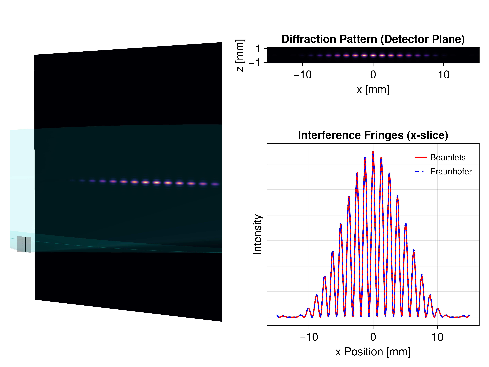

```@setup double_slit
beam_showcase_dir = joinpath(@__DIR__, "..", "assets", "examples")

Main.DocUtils.conditional_include(joinpath(beam_showcase_dir, "double_slit.jl"))
```

## Double slit diffraction

One of the most powerful applications of the beamlet tracing method is the simulation of coherent diffraction from complex apertures. The **BMO** package provides the [`AstigmaticGaussianBeamlet`](@ref) as an implementation of this formalism. More information can be found in the [Astigmatic polarized beamlets](@ref) section. By using a [`WavefrontBeamletDecomposition`](@ref), any arbitrary aperture mask (including phase-varying masks) can be decomposed into a set of coherent beamlets.

In the example below, a classic double-slit mask (10 µm width, 100 µm separation) is decomposed and propagated 0.2 meters. The simulation perfectly reproduces the analytical Fraunhofer diffraction pattern, showcasing both the individual slit diffraction (envelope) and the coherent interference fringes.



This example demonstrates the package's ability to maintain phase coherence across thousands of beamlets. This is, in principle, a prerequisite for high-fidelity modeling of systems like Atmospheric Turbulence or Phase-Modulating SLMs.